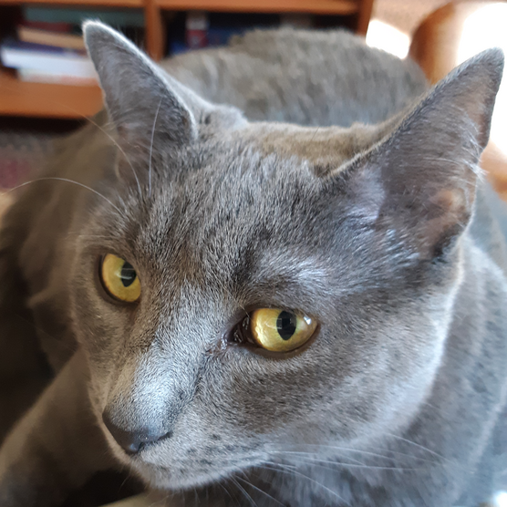

<div class='admonition caution'>
<div class='title'>Caution</div>
<div class='content'>
<ul>
<li>You are expected to work individually.</li>
<li><strong>Due: Friday February 25th at 11pm EST (Baltimore time).</strong></li>
<li><em>This assignment is worth 60 points.</em></li>
</ul>
</div>
</div>

## Learning objectives

<div class='admonition success'>
<div class='title'>Objectives</div>
<div class='content'>
<ul>
  <li>Arrays</li>
  <li>Command-line arguments</li>
  <li>Makefiles</li>
  <li>Recursion</li>
  <li>File I/O</li>
</ul>
</div>
</div>

## Overview

In this assignment, you will implement an interpreter for a very simple
graphics processing language.  The goal is to write a program which
interprets drawing commands and renders shapes and filled regions on
a drawing surface.

### Getting started

Do a `git pull` in your clone of the public repository to make sure
you have the latest files.

Create a `homework/hw3` directory in your private repo, and use `cd`
to go into it:

```
$ cd ~/my220repo
$ mkdir -p homework/hw3
$ cd homework/hw3
```

Now copy the starter files from the public repo:

```
$ cp -r ~/cs220-s22-public/homework/hw3/* .
```

### Working with image files

TODO: writeup about how to deal with the fact that the image files
are on ugrad, but they need to be on the local machine to view them.

## Concepts

The drawing program will draw pixels on a 2-D grid.  Each pixel has
a color specified by a combination of red, green, and blue color component
values. Each color component value is an integer in the range 0–255,
inclusive.

When the program generates an image, the input file will specify the
size of the pixel grid as some number of columns and some number of
rows.  The position of a pixel is specified as a column (x) and row (y)
coordinate.  The upper left pixel in the grid has coordinates x=0, y=0.
X coordinate values increase moving to the right, and y coordinate values
increase moving down.  So, if the pixel grid has 320 columns and 240 rows,
the lower right pixel has coordinates x=319, y=239.

## Image files

Once it has processed all of the drawing commands, the program will save
the final image to a text file.  The text file is a sequence of values.
Values are separated by one or more whitespace characters
(`' '`, `'\t'`, `'\n'`, `'\r'`, etc.)

The first two values are the width and height of the output image,
specifed as non-negative decimal integers.  For example, if the first
two values in an image file are

```
320 240
```

then the image will have 320 columns and 240 rows.

Following the width and height values will be a series of 3 × `width` × `height`
byte values, specified in hexadecimal (base 16.)  In hexadecimal, each "digit"
represents a value in the range 0–15, with the letters `a`–`f` representing
10 through 15.  For example, the hexadecimal byte value `3a` represents
(3 × 16) + 10 = 58. (Note that `a` means 10.)

Note that whitespace characters have no significance in an image file
other than to separate data values.  An image file may use newline
characters to avoid having very long lines, but your code to read an
image file should not treat newline characters (or any other kind of
whitespace character) specially.

You can read hexadecimal values in C using `fscanf` as follows. Assuming that
`in` is `FILE*` open for reading input, the code

```c
unsigned val;
int rc = fscanf(in, "%x", &val);
```

would attempt to read a single hexadecimal value into the variable `val`.
(Checking the value of `rc` will allow you to determine whether a hexademical
value was read successfully.)

Each pixel is represented as a red component value, a green component value,
and a blue component value, in that order. (This is why the number of byte values
is three times the number of pixels.)  The pixel color values are specified
row by row.  As an example, let's say the overall image size is 320 columns
and 240 rows. The first 320 × 3 color byte values specify the colors (r/g/b)
of the first row of 320 pixels. The next 320 × 3 byte values specify the colors
of the second row of pixels, and so forth.

In your code, you should use an array of `unsigned char` elements to represent
the pixel color component values for the entire image.  This array should store
the r/g/b pixel color values row by row, the same way that the values are stored
in the image file.

## Image functions

You are required to implement the following two functions:

```c
unsigned char *read_image(const char *filename, int *width, int *height);

int write_image(const char *filename, int width, int height,
                const unsigned char *buf);
```

You should add declarations for these functions to `cs220_paint.h` and definitions
for them to `cs220_paint.c`.

The `read_image` function should read image file data (expecting the format
described above) from the file named by the `filename` parameter.  If the image data is
read successfully,

* the width of the image (number of columns of pixels) should be stored in the
  variable that the `width` pointer is pointing to
* the height of the image (number of rows of pixels) should be stored in the
  variabel that the `height` pointer is pointing to
* the function should return a pointer to a dynamically-allocated array of
  color component values (stored as r/g/b triplets arranged row-by-row,
  as described above)

If `read_image` cannot successfully read a complete image, either because the
file exists, or the contents are not in the correct format, it should return
`NULL`.

The `write_image` function should write image file data to the file named
by the `filename` parameter.  The `width` and `height` parameters indicate
the width and height of the image.  The `buf` parameter is an array of color
component values (r/g/b triples, arranged row by row.)

If `write_image` successfully writes the complete image data, it should
return `1`, otherwise it should return `0`.

## `png2txt` and `txt2png`

The provided `png2txt.c` and `txt2png.c` programs convert between
[PNG files](https://en.wikipedia.org/wiki/Portable_Network_Graphics)
and the text-based image file format described above.  They work
by making calls to your `write_image` and `read_image` functions.

You should create a `Makefile` and add targets so that `png2txt` and `txt2png`
executables can be built, with the following dependencies:

* `png2txt` depends on `png2txt.o`, `pnglite.o`, and `cs220_paint.o`
* `txt2png` depends on `txt2png.o`, `pnglite.o`, and `cs220_paint.o`

The commands for these executables should (naturally) link the depended-on
object files into the correctly-named executable file (`png2txt` or `txt2png`.)

You'll need to add targets for the various `.o` files. Make sure you
specify their dependencies as appropriate (including any header files they
depend on.)

Once you have your `read_image` and `write_image` functions implemented,
and your `Makefile` has targets for `png2txt` and `txt2png`, you are
ready to work with image files.  A good way to test your code at this point
is to convert a provided PNG file `png/ingo.png` into an image file, and
then convert it back to PNG.  Try running the following commands:

```
$ make png2txt txt2png
$ ./png2txt png/ingo.png img/ingo.txt
$ ./txt2png img/ingo.txt png/ingo_copy.png
```

Then, download `png/ingo_copy.png` from your ugrad account. It should look like
this:

<a href="img/ingo.png"></a>

If the `png2txt` and `txt2png` programs worked correctly, then you should have
good confidence that your `read_image` and `write_image` functions work correctly.
Now, you can move on to the main program.

## The `cs220_paint` program

The `cs220_paint` program reads a graphics command file and generates an image
file with the result of rendering the drawing operations specified in the
command file.

You will need to add a target for the `cs220_paint` executable. It should
depend on `cs220_paint.o` and `driver.o`.  Note that you will most likely
need to link against the math library using the `-lm` option, since
one of the drawing operations will involve calling the `sqrt` function.
So, the command you use to link the `cs220_paint` executable might look
like this:

```
$(CC) -o cs220_paint driver.o cs220_paint.o -lm
```

Note that the `main` function is in `driver.c`. To the extent possible,
you should have your `main` function call functions whose definitions
are in `cs220_paint.c`. For example, your `main` function should
call `write_image` to write the image file once all of the drawing commands
have been processed, but it can also call functions to carry out
the drawing commands.

### Command file format

A command file has the following format.  Like the image file format,
the command file format is entirely text-based, so you should use `fscanf`
to read its contents.  Also, whitespace characters have no meaning other
than to act as separators, so formatting and line breaks have no significance.

A command file starts with two positive integers specifying the width and
height of the image to generate.  All pixels should start out as black,
meaning that their red, green, and blue color component values should be
set to 0.

Following the width and height are a series of 0 or more drawing commands.
Each drawing command starts with a single non-space text character.

The `c` command sets the drawing color.  The `c` character is followed by
three non-negative decimal integer values specifying the red, green, and blue
color component values for subsequent drawing operations. For example,
the command

```
c 0 200 200
```

would specify the following color: <span style="display: inline-block; background: #00c8c8; min-width: 2em;">&nbsp;</span>

The `r` command draws a filled rectangle.  The values following the `r` are the
integer x and y coordinates (pixel column and row) of the upper-left corner
of the rectangle, followed by the integer width and height of the rectangle.
The coordinates, width, and height will be non-negative.

The `e` command draw a filled ellipse.  The values following the `e` are the
floating-point x and y coordinates of the two focal points of the ellipse,
followed by a floating point length value.  To draw the ellipse, your
program should find all pixels such that the sum of

1. the distance between the focal points,
2. the distance from the first focal point to the pixel, and
3. the distance from the second focal point to the pixel

is less than or equal to the specified length, and set their colors to
the current drawing color. The focal point coordinates and the length
will all be non-negative.

The distance between two points *x*<sub>1</sub>, *y*<sub>1</sub> and
*x*<sub>2</sub>, *y*<sub>2</sub> is

> sqrt((*x*<sub>2</sub> - *x*<sub>1</sub>)<sup>2</sup> × (*y*<sub>2</sub> - *y*<sub>1</sub>)<sup>2</sup>)

Note that "sqrt" indicate the square root function.

The `f` command performs a *flood fill* operation. The two integer values
following the `f` character are the x and y coordinates of the start pixel.
The start pixel, and all pixels with exactly the same color as the start pixel,
*and* which are reachable through some path consisting of moves up, down, left,
and right from the start pixel, one pixel at a time, should be changed
to the current drawing color.

### Example command file

Here is an example command file:

```
320 240
c 0 200 200
r 100 80 140 96
c 72 0 128
e 160.0 75.0 26.7 175.1 344.9
c 212 212 0
r 180 180 44 4
r 220 160 44 4
r 180 200 84 4
r 180 180 4 24
r 220 160 4 24
r 260 160 4 44
c 208 167 0
f 251 168
```

After running the [resulting image file](hw3/test.txt) through the `txt2png`
program to convert it to a PNG file, the resulting image is this:

<a href="img/test.png"></a>

### Running

The `cs220_paint` program takes two command line arguments. The first is the
filename of the command file, and the second is the filename of the output
image file to create.  As an example, the following invocation would process
the commands in `cmd/test.txt` to produce the image file `img/test.txt`:

```
$ ./cs220_paint cmd/test.txt img/test.txt
```

Usually, you'll want to convert the image file to PNG so that you can view it
using an image viewer (once you've downloaded it onto your local computer):

```
$ ./txt2png img/test.txt png/test.png
```
