<div class='admonition caution'>
<div class='title'>Caution</div>
<div class='content'>
<ul>
<li>You are expected to work in a team of two or three.</li>
<li><strong>Released:</strong> Monday, Feb 28th</li>
<li><strong>Due:</strong> Friday, March 18th by 11pm Baltimore time</li>
<li><em>This project is worth 140 points</em></li>
<li>No late days may be used!</li>
</ul>
</div>
</div>

## Learning Objectives
<div class='admonition success'>
<div class='title'>Objectives</div>
<div class='content'>
<ul>
<li>structs</li>
<li>binary file I/O</li>
<li>nested loops</li>
<li>data representations</li>
<li>dynamic memory allocation</li>
<li>random numbers</li>
<li>math library functions</li>
<li>makefile</li>
<li>development tools <code>gdb</code>, <code>valgrind</code>, <code>git</code></li>
</ul>
</div>
</div>

## General Requirements

This is a team of two or three programming assignment, meaning you and one or two partners will collaboratively write and submit the source code for a program. You and your partner(s) should take a "paired programming" approach, where you frequently work together at a single screen. In this approach, at any given time one person is the "driver" with their hands on the keyboard, and the other is the "navigator" watching and guiding the driver. You should switch roles regularly. This method is particularly effective when you are testing and debugging your program. Remember, you are both responsible for all the code you submit and will receive the same grade.

As usual for coding assignments, you are required to use the `git` version control system and include a *log file* with your project submission. All partners must make sigificant commits to the project.

<div class='admonition caution'>
<div class='title'>Caution</div>
<div class='content'>
<p>We will provision you a separate repo for your midterm project under the <code>jhu-ip</code> organization and all team members along with course staff will be invited to have an admin role on the repo. You will both need to clone this new repo to get started. You should anticipate some conflicts when sharing a repo, and will need to resolve and merge them appropriately. Frequent commit/push/pull sequences are even more important in this situation.</p>
</div>
</div>

This project is larger and more complex than previous programming assignments. Additionally, since you have now been exposed to most of what C can do, there are no restrictions on what language features you can use (other than the conventions of good style, of course; you still shouldn't use global variables, for example).

<div class='admonition tip'>
<div class='title'>Tip</div>
<div class='content'>
<p>From this point forward in the semester, your programs will need to not only compile and run cleanly (i.e. with <strong>no warnings, errors, or crashes</strong>), but also <strong>must not have any memory-related issues</strong> (as reported by <code>valgrind</code>).</p>
</div>
</div>

## Program Description
This program will be a texture synthesis application. It will take as its input an example texture image (the _exemplar_) and will grow the texture into a larger image. It will have a command-line-based user interface (UI), so there will be no graphical interface. In particular, the program will read in the exemplar image's file-name from the command prompt, as well as the output image's dimensions, the output images file-name and the radius of the search window. It will then synthesize the new texture and output it to the prescribed file.

As an example, the table shows several exemplar textures (left) and the 128x128 textures synthesized using various window radii (right).

exemplar | radius=2 | radius=5 | radius=10 | radius=15
:------: | :------: | :------: | :-------: | :-------:
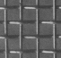 | 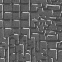 | 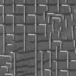 | 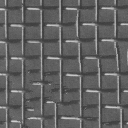 | 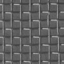
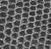 | 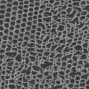 | 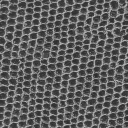 | 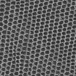 | 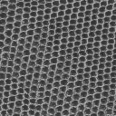
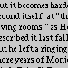 | 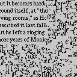 | 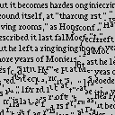 | 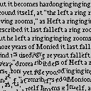 | 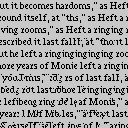
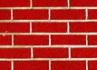 | 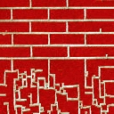 | 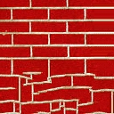 | 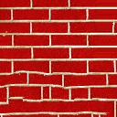 | 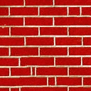
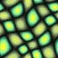 | 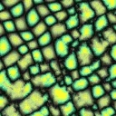 | 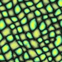 | 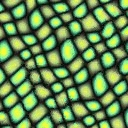 | 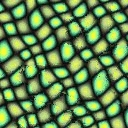

(Note that the texture is grown from the top left, so the top left corner of the output images exactly matches the exemplar.)

### Viewing your results
Since your program will not have a GUI, you will use external programs to view the images. If you are on ugrad (either locally, or remotely with X-tunnelling), you can use the program `feh`.

<div class='admonition info'>
<div class='title'>Info</div>
<div class='content'>
<p>For this project, you will be working with images in a PPM format (described below). This means that you will want to view images, which means that in order to work remotely on the ugrad machines, you will need to set up X-tunnelling using <a href="https://sourceforge.net/projects/xming/">Xming</a> on Windows or <a href="https://www.xquartz.org/">XQuartz</a> on Mac (Reach out to us if you need help to set this up). Also, PPM images can be quite large; be aware of file sizes, and try not to fill up your hard drive (or your disk quota on ugrad) with thousands of pictures...</p>
<p><code>feh</code> is a very simple command-line image viewer. It is available on ugrad machines and you can simply run the program with the name of an image file as a command-line argument, and it will display the image on your screen. e.g.</p>
<div class="sourceCode" id="cb1"><pre class="sourceCode sh"><code class="sourceCode bash"><a class="sourceLine" id="cb1-1" title="1">$ <span class="ex">feh</span> myimage.ppm</a></code></pre></div>
<p><strong>Note:</strong> Before running <code>feh</code>, make sure either Xming or Xquartz is running and x-tunneling is enabled (i.e. add -Y on mac when you <code>ssh</code> in to ugard. On Putty, enable x-11 forwarding option)</p>
</div>
</div>

If you are using a different platform, you are welcome to use an image viewer of your choice; `feh` is easy to install using most linux package managers, but there are other open source image viewing programs, as well as alternatives for Windows and MacOSx.

While there are many formats for storing image files, your program will **only** need to read and write one, the **PPM** format. This is essentially the simplest and easiest format to read and write, which is why it was chosen; its main drawback is that it does not use any kind of compression, so images stored in this format tend to be on the large side when compared to formats like JPEG or PNG or GIF. An implementation to read PPM files is provided for you. However, you will need to write the corresponding method to write to a PPM file format. (See `ppm.h` and `ppm.c` in the starter code.)

<div class='admonition caution'>
<div class='title'>Caution</div>
<div class='content'>
<p>Make sure to do a <code>git pull</code> on the public repo before starting to work to get the starter files for this project. You must work with the starter files!</p>
</div>
</div>

### PPM image format

For this assignment, we will use a very simple image-file format called PPM (Portable Pixel Map). It's an uncompressed format, meaning that the images will take up a lot of disk space (compared to JPG or PNG files), but it's very easy to read and write from C code (which is why we're using it). For the formal "official" description of the PPM format, see the [netpbm site](http://netpbm.sourceforge.net/).

<div class='admonition info'>
<div class='title'>Info</div>
<div class='content'>
<p>NOTE: you can use a unix program called <code>convert</code> to convert between image formats; e.g. to convert an existing file called "selfie.jpg" into a PPM, you would type:</p>
<pre><code>$ convert selfie.jpg selfie.ppm
</code></pre>
<p>This works for most image format file extensions; it converts to/from most known image formats, including .jpg, .gif, .png, .ppm, .tiff, and .pdf, and is installed on the ugrad machines. If it's not installed on your local machine (or virtual machine), most linux package managers can install it (or can install ImageMagick, which is the suite of tools that <code>convert</code> is part of).</p>
</div>
</div>

The PPM format itself is pretty simple (compared to most other image formats). Basically, at the top of the file will be a special "tag" that marks the file as a PPM; this should be "P6". Then, there are three numbers, separated by whitespace; these numbers represent the size of the image as columns, rows, and colors. Columns and rows specify the width and height of the image (in pixels) respectively. (BEWARE: columns come before rows in this format!) Colors encodes how many different shades of each color a pixel can take on; for this assignment, this number must always be 255 (you must reject any image that uses a different value, but you're unlikely to encounter one). Immediately after the 255 the binary data encoding pixels begins. 

Optionally, there may be lines starting with a #, which are comments and should be ignored; these may be intermixed with the above information. You don't need to store these; if you read a file and then re-write it, it's fine if the comments get lost.

All of this will be ANSI text, so you can use the normal text functions (e.g. fgetc(), fscanf(), fprintf() etc.) to read/write the header information.

After the color size specification, there will be a **single** whitespace character (usually a newline, but that's not guaranteed), after which the remainder of the file will be the actual pixel values. Basically, each "pixel" consists of three values; the first value is the "red" channel, the second value is the "green" channel, and the third value is the "blue" value. Taken together, these three values specify a single color, which is the RGB color value of that pixel. Since the max color value is 255, each of these values will be in the range 0-255, which fits exactly in one byte of memory. For more information about RGB color codes see [Wikipedia](https://en.wikipedia.org/wiki/RGB_color_model).

<div class='admonition caution'>
<div class='title'>Caution</div>
<div class='content'>
<p>The PPM format stores the red, green, and blue channels of an image as three consecutive bytes. However, for this project you will need a fourth chanel -- the <em>alpha</em> channel. As a result, you will not be able to read/write a <code>Pixel</code> struct directly from/to a PPM file. There are many ways you can address this. You can create a second, three-channel, struct, read into that, and then copy the information to the four-channel <code>Pixel</code> struct. Alternatively, you can use the fact that the alpha channel is the last channel, and read in the pixels three bytes at a time, thereby setting the red, green, and blue channels.</p>
</div>
</div>

Your first coding task for this project is to write the `WritePPM` function in the `ppm.c` implememtation file, as well as the `AllocateImage` and `FreeImage` functions in the `image.c`implementation file. We have provided implememtations of `ReadPPM` in `ppm.c`.

#### Testing your PPM writing code
Once you implement the `WritePPM` function, you can validate your implementation by reading in an input image (using the provided `ReadPPM` function), write it out (using your implementation of `WritePPM`) and then comparing the file you read to the file you wrote (using the `idiff` command).

Recall that you can compare images (include PPM images) using the `idiff` command. In particular, given two image files `img1.ppm` and `img2.ppm`, you can run:
```
$ idiff img1.ppm img2.ppm
```
If your `WritePPM` code is correct, then the `idiff` should indicate that the comparison `PASS`ed.

Once you have confirmed that your image i/o works, you are ready to start implementing texture synthesis.

## Operational Overview

Your program will be a command line tool, always run with the name of the executable file project followed by the name of an input PPM file, the name of the output PPM file, the width and height of the output image, and the window radius to be used for texture synthesis. There is no input entered by the user interactively.

For example, to generate the images in the second row of the table above, a user of your program would type:

```sh
$ ./project d3.ppm d3.out.2.ppm 128 128 2
$ ./project d3.ppm d3.out.5.ppm 128 128 5
$ ./project d3.ppm d3.out.10.ppm 128 128 10
$ ./project d3.ppm d3.out.15.ppm 128 128 15
$ ./project d3.ppm d3.out.20.ppm 128 128 20
```

## Development Plan
For this project, the development plan is largely in your hands. You are required to create a `Makefile` and submit it for this project, and the main executable it generates should be named `project`. You should also rigorously test your code, but you are not required to hand in specific tests with your submission. Beyond that, it is largely up to you how to structure your project, but you **must take a modular approach**.

We recommend that you break your code into several files, and have as little code as possible in main(). Here is a suggested (but not required) breakdown of features into files:

- `Makefile` -  you **must** include a `Makefile` that can build your program; it's how the graders will compile your submission. You are required to build a target whose name is `project`.
- `project.c` - the main program. The `main()` function should be extremely simple; it might just read in the exemplar image, invoke the function performing the texture synthesis, write the resulting image out, and then return 0. A `project.c` with a mostly empty `main()` is provided in the starter code. (Note that the provided implementation of `main()` includes functionality allowing you measure the running time of your algorithm. You can keep that in there.)
- `ppm.c` - contains implementations of functions for reading and writing PPM. You must implement the missing `WritePPM` file.
- `ppm.h` - the header file for PPM I/O stuff (including function declarations).
- `image.c` - contains the implementations for allocating and deallocating images. You must implement the missing `AllocateImage` and `FreeImage` functions. You may add other general-purpose image processing functions to this file.
- `image.h` - the header file for image stuff (struct and function declarations). This header declares a number of functions that may be useful to you in the course of the assignment. Be sure to look this over so you don't end up re-inventing the wheel.
- `texture_synthesis.c` - you will implement the texture synthesis within the `SynthesizeFromExemplar` function. (Though you should, of course, feel free to use helper functions.)
- `texture_synthesis.h` - the header file for the texture synthesis.

You can find a description of the provided functionality
[here](midterm/index.html).

<div class='admonition info'>
<div class='title'>Info</div>
<div class='content'>
<p>The list above is not a list of ALL files that should be included in your submission. It is only a minimal listing of source code files.</p>
</div>
</div>

We recommend that before you start coding, you make a **development plan**. This means that you sit down and plan out (on paper) how you will break the program down into modules (e.g. functions or groups of functions), what each module will do, and how they will interact. You should also plan who/when/how each will be coded, leaving yourselves a week for debugging! 

<div class='admonition tip'>
<div class='title'>Tip</div>
<div class='content'>
<p>Aim to write small, clean helper functions for better readability and easier testing, as well as greater reusability. Then, make a plan for what order you will implement the modules in. You will also want to test your modules; it's a good idea to use test-driven design, which means that you will design tests for your functions before you actually start trying to write the functions themselves.</p>
</div>
</div>

For each module, it's important to think about precisely what it should do, and also how you can test it to be sure it's doing what you want. There are lots of ways of testing your code; for this project, a lot of your tests will likely involve the visual inspection of output images to see if they look the way they're supposed to. Still, having an idea of how you'll test each piece before you start writing it (and then testing/fixing it before you move on to the next one) will make your life a lot easier.

<div class='admonition tip'>
<div class='title'>Tip</div>
<div class='content'>
<p>Some results images are provided in the starter code under <code>results</code> folder. The filename will be of the form &lt;<code>header</code>&gt;.&lt;<code>res</code>&gt;.&lt;<code>radius</code>&gt;.ppm where &lt;<code>header</code>&gt; is the header of the .ppm file in the <code>data</code> directory provided for processing, the synthesized image is of size <code>res</code>x<code>res</code>, and the window radius was <code>radius</code>. Note that because the algorithm requires randomness, it is possible for you to implement the method correctly and get results that are qualitatively similar but pixel-wise different. (See the <em>Comparing Your Code</em> section below.)</p>
</div>
</div>

### Scaffolding Folder
The scaffolding (i.e. starter code) folder for this project (available in the public repository) provides you with `ppm.c`, `ppm.h`, `image.c`, `image.h`, and `project.c`. (You will need to write the `Makefile` yourself.) It also contains some testing PPM files in a folder named `data` and some expected results in a subfolder named `results`, which is in the PPM format. Lastly, we provide starter files `texture_synthesis.h` and `texture_synthesis.c` which is where your implementations of the texture synthesis should be added.

<div class='admonition info'>
<div class='title'>Info</div>
<div class='content'>
<p>Note that the results displaying on this page are jpg versions. You should use the provided PPM ones for comparison.</p>
</div>
</div>

We encourage you to store the provided PPM images and all created images in a subfolder of your own repository named `data`, to keep your images separate from your source code files. You don't need to submit any PPM files to us; keeping them in a separate folder will help you avoid accidentally including them.

<div class='admonition tip'>
<div class='title'>Tip</div>
<div class='content'>
<p>If you're using the <code>data</code> subfolder, we suggest you to execute your code from within the <code>data</code> folder by typing <code>../project</code>, so you can refer to input filenames while the program is executing directly as <code>D3.ppm</code>, rather than <code>data/D3.ppm</code>, saving yourself the extra typing while testing.</p>
</div>
</div>

## Error Reporting
The approach your program will take for error reporting is to have your `main()` method return a `0` value indicating success or a positive value indicating failure. Which positive value your program should return is indicated in the table below. If more than one error condition occurs, your program should return the error code listed earliest in the table below.

In addition to returning the specified value, your program should also output an informative error message to stderr. (The text of the error messages will not be specified; we'll leave the exact wording up to you.)

| Return value | Error condition it signifies |
|--------------|------------------------------|
| 0 | No errors detected |
| 1 | Wrong usage (i.e. arguments are not provided) |
| 2 | Input file I/O error | 
| 3 | The Input file cannot be read as a PPM file | 
| 4 | Output file I/O error |
| 5 | Other errors not specified above |

## Approach

The texture synthesis you are implementing is essentially the one described by Efros and Leung in their seminal [Texture Synthesis by Non-parametric Sampling](https://people.eecs.berkeley.edu/~efros/research/NPS/efros-iccv99.pdf) paper. This section summarizes the approach described in the paper, though you may also find the [authors' pseudo-code](https://people.eecs.berkeley.edu/~efros/research/NPS/alg.html) useful. (Note that our implementation does not use the `MaxErrThreshold` variable.)

The goal is to extend, or grow, an exemplar texture into a larger texture with the same qualitative "feel". Starting with an exemplar image, you will first create a new image with width and height as prescribed on the command line, and you will copy the exemplar image into the top left corner. (You will need to check that the width and height are big enough to contain the exemplar.) For example, starting with the image
<CENTER>
<BR>
</CENTER>
and a target width and height of 128, you may generate an image like:
<CENTER>
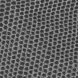<BR>
</CENTER>
In the course of processing, every pixel will be marked as either _set_ or _unset_, with _set_ pixels identified by having a non-zero alpha value. Initially, only the pixels copied from the exemplar image will be marked as _set_.

You will then iterate through the image, identifying _unset_ pixels (visualized in black) that are adjacent to _set_ pixels and you will assign them color values. That is, if you were to output an image after each step of processing (visualizing unset pixels in black) and you were to makes those images the frames of a video, you would get something that looks like:
<CENTER>
<VIDEO controls autoplay SRC="img/d3.mp4" TYPE="video/mp4"></VIDEO>
</CENTER>

The approach you will take is as follows.
* You will identify and sort those _unset_ pixels in the output image whose colors are ready to be synthesized (i.e. which are immediately adjacent to _set_ pixels).
* For every pixel in the to-be-synthesized (TBS) pixel list
	* You will create a window around the pixel and compare that windows about **every** exemplar pixel.
		For example, given the selected pixel shown in the center of the 5x5 (yellow) window below (left):<BR>
		<CENTER>
		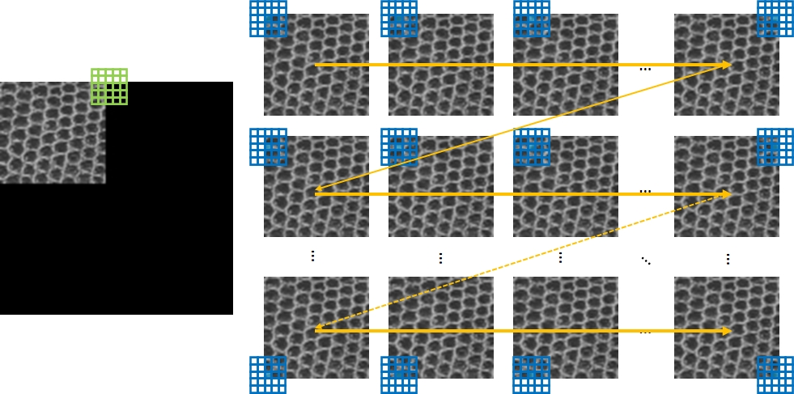
		</CENTER><BR>
		you will center a 5x5 (blue) window over each exemplar pixel and compare the pixels within the 5x5 window about the TBS pixel to the corresponding pixels in the 5x5 window about the exemplar pixel (right).
		
		Note that in the course of processing, we iterate row by row. Starting at the top (row zero) and moving to the bottom. Within a row we traverse the pixels from left (column zero) to right.

		Note also that in this example, when the TBS pixel is at the top-right, the comparison to the first two (top-left) exemplar pixels will be ignored. This is because the TBS pixel has six neighboring pixels that are set (below and to the left) but not all of the corresponding pixels in the windows about the two exemplar pixels are interior the exemplar image.
	* Once you have compared the window around the TBS pixel to the windows about every exemplar pixel, you will identify an exemplar pixel which is a good match, copy its color into the TBS pixel, and change the TBS pixel to _set_.
* You will repeat the process until there are no _unset_ pixels in the output.

<div class='admonition caution'>
<div class='title'>Caution</div>
<div class='content'>
<p><strong>The code will not be fast.</strong> For <strong>every</strong> <em>unset</em> TBS pixel it needs to compare a window about the <em>unset</em> pixel to a window about <strong>every</strong> exemplar pixel. And that comparison requires looking at the difference in pixel values for <strong>every</strong> pixel within the window. This will make the running time slow, and it will get slower as you increase the window radius. For example, for the texture synthesized above for the <code>D3</code> exemplar with radii 2, 5, 10, and 15, the respective running times (on my computer, after optimization) were 6.3, 23.3, 69.1, and 131.0 seconds.</p>
</div>
</div>


### Implementation details

#### Tracking (_un_)_set_ pixels:
To support the tracking of pixels, each pixel will contain four channels. The red, green, and blue channels, describing the color of the pixel, as well as an alpha channel. When you read the exemplar image, it will only have red, green, and blue values. However, once you copy it over into the (dilated) synthesized image, you will set the alpha channel for all the exemplar pixels in the top left corner to 255 and you will set the alpha channel for the remaining pixels to 0.

Then, in the course of your processing, you can identify if a pixel has been _set_ by checking its alpha channel.

### Identifying to-be-synthesized (TBS) pixels for processing
To identify the set of pixels that are ready to be synthesized, you will iterate over all the pixels in the output image and identify those which are _unset_ (alpha value is zero) but have an immediate neighbor (vertical, horizontal, or diagonal) that is _set_.

You will sort these pixels, ordering them so that TBS pixels with more _set_ neighbors are earlier in the list. You will further randomly sort the list of TBS pixels to resolve ties when two TBS pixels have the same number of _set_ neighbors.

<div class='admonition tip'>
<div class='title'>Tip</div>
<div class='content'>
<p>To help you with the sorting, the <code>texture_synthesis.h</code> file defines a struct <code>TBSPixel</code> which stores information about where the TBS pixel is (the <code>idx</code> member), how many of the neighbors are <em>set</em> (the <code>neighborCount</code> member) and a random value for resolving ties in the sorting (the <code>r</code> member). When you generate the list of TBS pixels, you should only set the first two members. You can then call the <code>SortTBSPixels</code> which will sort this list for you, reordering so that TBS pixels with larger <em>set</em> neighbor counts occur earlier in the list and resolving ties appropriately.</p>
</div>
</div>

<div class='admonition caution'>
<div class='title'>Caution</div>
<div class='content'>
<p>In defining the TBS pixels for the current iteration you should only be using immediate pixel neighbors (at most 8), independent of the value of the window radius parameter read in from the command line.</p>
</div>
</div>

### Iterating over exemplar pixels
Given a radius `r` as prescribed on the command line, you will be using a window whose width and height are 2x`r`+1. You will center the window about **every** exemplar pixel and compre the window about the exemplar pixel to the window about the TBS pixel. Note that it will not always be the case that the window about the exemplar (resp. TBS) pixel fits within the exemplar (resp. synthesized) image. In that case, you should only use pixels that are within the image.

Furthermore, when the window about the exemplar pixel does not fit into the exemplar image, you have to make sure that every set pixel in the window about the TBS pixel has a corresponding pixel in the window about the exemplar pixel. If it does not, you should not consider that exemplar pixel as a candidate match.

### Comparing windows
When comparing a window about a TBS pixel to a window about an exemplar pixel, you will compute the weighted sum of squares differences of the red, green, and blue channels of corresponding pixels. You will **not** perform the comparison for pixels in the TBS window which are _unset_. However, if there is a pixel in the TBS window that is _set_ and the corresponding pixel in the window around the exemplar pixel falls outside the exemplar image, you will not consider that exemplar pixel as a candidate for setting the TBS color value. When computing the weights for the contribution of a given pixel comparison, you will use a Gaussian function that falls off with distance from the center of the window. The Guassian will have a standard deviation `Sigma` equal to the window width divided by 6.4 -- `Sigma` = (2x`r`+1)/6.4.

Assuming that you are considering a TBS pixel with column/row index (`colS`,`rowS`) and an exemplar pixel with column/row index (`colX`,`rowX`), pseudo-code for this could look something like:
* set `diff`=0
* for every pair of integer offsets (`col`,`row`) with `col` and `row` in the range {-`r`...`r`}
	* if the pixel (`colS`+`col`,`rowS`+`row`) is within the output image and is _set_
		* If the exemplar pixel at (`colX`+`col`,`rowX`+`row`) is not within the exemplar image, skip the comparison of the TBS window and the exemplar window.
		* set `d` to be the squared differences of the red, green, and blue values of pixel (`colS`+`col`,`rowS`+`row`) in the synthesized image and pixel (`colX`+`col`,`rowX`+`row`) in the exemplar image.
		* set `s` to be the evaluation of the Gaussian: `s` =exp( -(`col`x`col`+`row`x`row`)/(2x`Sigma`x`Sigma`))
		* increment the difference: `diff` += `d`x`s`

<div class='admonition tip'>
<div class='title'>Tip</div>
<div class='content'>
<p>you should be careful in computing the sum of squared differences as the red, green, and blue values are stored as <code>unsigned char</code>s. To help you out, the <code>image.h</code> file declares (and <code>image.c</code> defines) the <code>PixelSquaredDifference</code> function which takes two <code>Pixel</code>s as input and returns a double value corresponding to the sum of squared differences of red, green, and blue values.</p>
</div>
</div>

### Selecting a good exemplar pixel for a given to-be-synthesized (TBS) pixel
To find a good exemplar pixel, you will go through all the exemplar pixels and find `min`, the minimum sum of squared differences computed over all exemplar windows. You will then identify all exemplar pixels whose associated sum of squared differences is no larger than `min`x(1.1) and you will pick a random exemplar pixel from within those.

## Comparing Your Code
Comparing your results to a "ground-truth" solution is hard because of the inherently stochastic (random) nature of the algorithm. To help you along, we have:
* Seeded the random number generator at the beginning of the `main` function.
* Provided a function `SortTBSPixels` that sorts the TBS pixels in the array, resolving ties in a consistent manner. Note that for you to get results consistent with ours, the entries in the TBS array have to satisfy the following properties (before calling `SortTBSPixels`):
	* The entries have distinct pixel indices.
	* The `neighborCount` value of an entry cannot be zero.

However, if you really want to reproduce our results you will also need to ensure that when you compute the array of candidate exemplar pixels (from which you will pick one at random), those candidate pixels are sorted so that pixels coming earlier in the image (i.e. in earlier rows, or in earlier columns if the two pixels are in the same row) appear earlier in the candidate list.

## Submission

<div class='admonition danger'>
<div class='title'>Danger</div>
<div class='content'>
<p>Remember that programs which do not compile (with standard compiler flags on the ugrad machines) will not receive credit. Additionally, points will be deducted for any compiler warnings. Points will also be deducted for any warnings, errors, or memory leaks reported by <code>valgrind</code>. All executables should be buildable using a <code>Makefile</code> with <code>project</code> as the main target, and should build and run cleanly.</p>
</div>
</div>

<div class='admonition tip'>
<div class='title'>Submission</div>
<div class='content'>
<p>Submit your project via Gradescope. Your submission should contain all source code and files necessary to compile your program (including a <code>Makefile</code>) as well as a <code>README</code> file (which includes all partner names, JHEDs and Hopkins IDs) and a <code>git log</code> file from your midterm project repo. The <code>log</code> should indicate that all team members were contributing code and pushing their contributions to the repository. Your submission <strong>should not</strong> contain any compiled binaries (executables or object files), or any testing-related files (in particular, <strong>please do not submit any image files</strong>).</p>
<p>The requirements for your <code>git log</code> are the same as in previous assignments, except note that we expect all members of your team to be contributing commits to your shared midterm project repo.</p>
</div>
</div>

<div class='admonition caution'>
<div class='title'>Caution</div>
<div class='content'>
<p><strong>Only one team member should submit the project on Gradescope, but all partners' name(s) must be included in the Gradescope submission.</strong> The same team member should submit all versions of the project in his/her account. <strong>Also make sure that the README includes the names, JHEDs and Hopkins IDs of both team members</strong>, so that each student gets credit for this work.</p>
</div>
</div>
